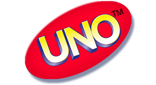
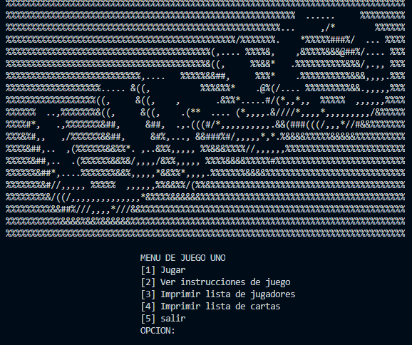

<h1 align="center">Juego UNO-PROYECTO PC 2020-3</h1>

  
   
  <i>UNO es un juego de cartas para toda la familia con 108 cartas
      el que se quede con una sola carta GANA</i>
   

## Documentacion

Para saber mas acerca del juego aca esta la documentacion:

- [Reglas del juego][reglas]
- [Enunciado del proyecto][enunciado]

## Imagenes de muestra

  

  
   
  <i>Pantalla principal del juego</i>
   

[contributing]: CONTRIBUTING.md
[reglas]: assets/documentacion/reglas.pdf
[changelog]: CHANGELOG.md
[ng]: https://angular.io
[documentation]: https://angular.io/docs
[angularmaterial]: https://material.angular.io/
[cli]: https://cli.angular.io/
[enunciado]: assets/documentacion/enunciado.pdf
[componentstemplates]: https://angular.io/guide/displaying-data
[forms]: https://angular.io/guide/forms-overview
[api]: https://angular.io/api
[angularelements]: https://angular.io/guide/elements
[ssr]: https://angular.io/guide/universal
[schematics]: https://angular.io/guide/schematics
[lazyloading]: https://angular.io/guide/lazy-loading-ngmodules
[node.js]: https://nodejs.org/
[npm]: https://www.npmjs.com/get-npm
[codeofconduct]: CODE_OF_CONDUCT.md
[twitter]: https://www.twitter.com/angular
[gitter]: https://gitter.im/angular/angular
[meetup]: https://www.meetup.com/find/?keywords=angular"
