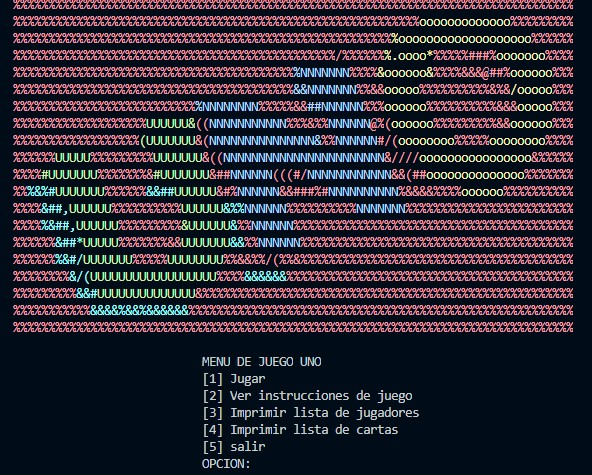

<h1 align="center">Juego UNO-PROYECTO PC 2020-3</h1>

  
   
  <i>UNO es un juego de cartas para toda la familia con 108 cartas
      el que se quede con una sola carta GANA</i>
   

## Documentacion

Para saber mas acerca del juego aca esta la documentacion:

- [Reglas del juego][reglas]
- [Enunciado del proyecto][enunciado]

## Imagenes de muestra

  

  
   
  <i>Pantalla principal del juego</i>
   

[contributing]: CONTRIBUTING.md
[reglas]: assets/documentacion/reglas.pdf
[documentation]: https://angular.io/docs
[enunciado]: assets/documentacion/enunciado.pdf

